# Trent Nodes

Professional video processing, scene detection, and utility nodes for ComfyUI.

[](LICENSE)
[](https://github.com/comfyanonymous/ComfyUI)

---

### NEW: Ask Local LLM (GGUF)

> General-purpose chat with the same local GGUF LLM the H3 Skill
> Promptor uses — ask it anything, no H3 contract attached. Write or
> refine prompts for any model, describe attached images, brainstorm.
> Defaults mirror the promptor's server spec exactly (port 8735,
> ctx 32768, mmproj auto), so a resident Qwen3.8 server is reused with
> **zero reload** in either direction. Editable system prompt, optional
> `input_text` wire-in for "improve this prompt" flows, and a
> `history_json` output that chains node-to-node for multi-turn
> follow-ups. Find it under **Trent/VLM**.

### NEW: Batch Loader Cowboys (Text File / Ref Folder / Ref Preview)

> Filename-keyed batch loading for per-clip render pipelines. Wire
> **VideoFolderCowboy**'s `filename` output into the new
> **TextFileCowboy** and **RefFolderCowboy**, and clip `000.mp4`
> automatically pairs with `prompts/000.txt` and `refs/000/`.
> TextFileCowboy loads one prompt file per clip (natural sort,
> wrap/clamp/error index modes, mtime cache-busting).
> RefFolderCowboy loads up to six reference images onto six fixed
> IMAGE outputs — empty slots emit None, which optional inputs like
> the MiniMax H3 `ref_image` sockets silently skip, so all six stay
> wired and empty folders run ref-less instead of erroring.
> **RefPreviewCowboy** previews whichever slots actually hold images
> (None-tolerant, mixed sizes OK).
> Find them under **Trent/Text** and **Trent/Image**.

### NEW: Organize Group as Grid (Canvas Tool)

> One-hotkey cleanup for messy groups. Select any group(s), hit
> **Shift+Alt+A**, and every child node snaps into a left-to-right
> layered layout based on connection order — sources on the left,
> sinks on the right, columns ordered by topological depth. Within
> a column, nodes are stacked top-to-bottom by the mean y of their
> downstream targets so wires stay roughly parallel. Collapsed
> nodes right-align inside their column so their output sockets
> stay close to the next column. The group then resizes to wrap
> the result. One Ctrl+Z reverts everything.
> Find it under **TrentNodes** menu.

### NEW: PSD Background Replacement (3 modes + auto-detect)

> Swap backgrounds in messy PSDs where there's no clean single
> "background" layer. **PSDLayerCompositor** now supports three
> replacement modes:
>
> - **single** — swap one layer by index (original behavior).
> - **replace_range** — swap a contiguous range of layers
>   `[replacement_index..replacement_end_index]` with one image,
>   sized to the canvas or the layers' union bbox.
> - **underlay** — paste the replacement under all original layers
>   (escape hatch when you can't pin down the background range).
>
> **PSDBackgroundDetect** scores layers from the splitter manifest
> using name regex, full-canvas coverage, opacity, blend mode, and
> bottom-bias, and outputs a recommended `bg_start` / `bg_end` range
> to wire into the compositor. Use the detect → range → underlay
> ladder when one mode doesn't quite fit.
>
> v1 limitation: PSD re-export (`output_psd_path`) only works in
> `single` mode. Find them under **Trent/PSD**.

### NEW: CorridorKey Green Screen Keyer

> Neural green screen keying using **CorridorKey** (Corridor Digital).
> Instead of producing binary masks, it **unmixes true foreground color**
> from the green background, preserving semi-transparent details like
> hair, motion blur, and out-of-focus edges. Outputs clean foreground,
> alpha matte, and composite preview. Uses **BiRefNet** for automatic
> alpha hint generation when no mask is provided.
> Find it under **Trent/Video**.

### NEW: Video Degradation

> Apply configurable, **temporally coherent degradation** to video frames
> for generating synthetic training pairs. 15 built-in presets (VHS,
> dashcam, security cam, old film, underwater, and more) plus full custom
> control over motion blur, defocus, noise, compression artifacts,
> chromatic aberration, interlacing, rolling shutter, and lens distortion.
> Find it under **Trent/Video**.

### NEW: VHS Swap (Canvas Tool)

> One-hotkey swap of native ComfyUI video nodes to **VHS equivalents**.
> Replaces LoadVideo with VHS_LoadVideo and SaveVideo with VHS_VideoCombine,
> automatically collapsing intermediate GetVideoComponents and CreateVideo
> nodes. Works on selected nodes or the entire graph. **Shift+V**
> Find it under **TrentNodes** menu.

### NEW: Wire VHS Combine (Canvas Tool)

> Pairs with VHS Swap. Once you have a VHS Load Video and a
> VHS_VideoCombine in the graph, hit **Shift+Alt+V** to: add (or
> reuse) a `VHS_VideoInfo` off the Load's `video_info` output,
> convert the Combine's `frame_rate` widget to an input and wire
> the source `loaded_fps` into it, and set the Combine to
> `video/h264-mp4` with `crf=13`. Selection-aware (uses selected
> nodes when present, otherwise falls back to the single matching
> pair in the graph). Single Ctrl+Z reverts everything.
> Find it under **TrentNodes** menu.

---

## Installation

### Via ComfyUI Manager (Recommended)
Search for "Trent Nodes" in ComfyUI Manager and click Install.

### Via Comfy CLI
```bash
comfy node registry-install trentnodes
```

### Manual Installation
```bash
cd ComfyUI/custom_nodes
git clone https://github.com/TrentHunter82/TrentNodes.git
cd TrentNodes
pip install -r requirements.txt
```

## Nodes

All nodes are organized under the `Trent/` category for easy navigation.

### Trent/Video (13 nodes)

**Cut Detective**

Neural shot-boundary detection with a film-strip preview. Finds every cut in a clip, says what kind of cut each one is, and hands the cut list to the H3 Auto Prompt Generator.

- **Detectors.** The `detector` widget defaults to `auto`, which tries [OmniShotCut](https://github.com/UVA-Computer-Vision-Lab/OmniShotCut) first: a 2026 shot-query video Transformer from the UVA Computer Vision Lab, range F1 0.883 against 0.814 for both TransNetV2 and AutoShot, and the only one of the three that labels a boundary as a dissolve, wipe, fade, whip-pan or sudden jump instead of just flagging it. `transnetv2` is the proven baseline, ships its weights in the wheel, runs on CPU, and reports hard cuts only. `classic` is the frame-difference detector Chop Cuts uses — no model, no download, and a safety net rather than a peer.
- **Knowing which detector ran.** A cascade that quietly slides down to `classic` would hand H3 a worse cut list with nothing to show for it. The `detector_used` output names what actually ran, the report headlines a fallback, the film-strip subtitle flags it, and the console logs it as a warning. `fallback_policy` sets how far `auto` may fall: `cascade` (all three), `neural_only` (never `classic`), or `strict` (OmniShotCut or an error).
- **Tuning.** `sensitivity` drives TransNetV2's threshold and the classic detector's, and OmniShotCut ignores it — it predicts shot ranges directly. Its real knob is `omnishotcut_overlap`, the overlap between 100-frame inference windows; raise it when a boundary near a window edge looks wrong. Move `sensitivity` on the OmniShotCut path and the report says it did nothing.
- **Outputs.** `cut_times` (comma-separated seconds), `shot_table` (one readable line per shot), `film_strip` (a labelled contact sheet with a colour-coded cut marker per shot and a proportional timeline ribbon), `report`, `cuts_json`, `num_shots`, `detector_used`.
- **Film strip.** One thumbnail per shot by default; `thumbs_per_shot` samples further into long shots. The first card of a shot is always the frame right after the cut, and only it carries the coloured edge, so a boundary stays legible when a shot wraps across rows. Shots are never dropped to fit the sheet — the thumb count degrades instead, and the subtitle says so.
- **Feeding H3.** Wire `cut_times` into the H3 Auto Prompt Generator's `cut_times` input. The VLM is then told to write exactly those shots, and the assembler forces the `[Shot N]` times onto the measured cuts instead of rescaling them proportionally. Any of the three string outputs works — the parser also reads timecodes, `[Shot N] At MM:SS.mmm` labels, and hand-typed lists across several lines.

OmniShotCut is not on PyPI and is not installed automatically. Install it with `--no-deps`, which matters: its `requirements.txt` pins `transformers==4.57.3` and its `pyproject` lists torch, so a plain install can downgrade a working ComfyUI environment.

```bash
pip install --no-deps git+https://github.com/UVA-Computer-Vision-Lab/OmniShotCut.git
```

It needs CUDA, and downloads a 164 MB checkpoint from HuggingFace on first use. Without it, Cut Detective falls back to TransNetV2.

**Chop Cuts**

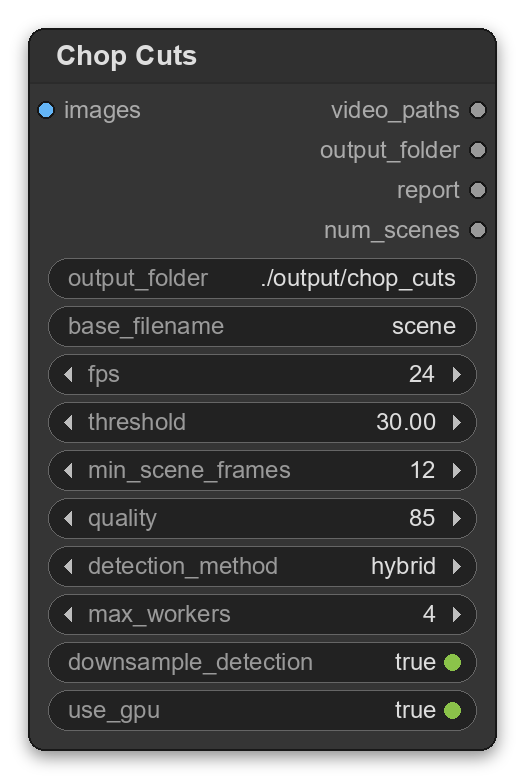

Accurate scene detection and video splitting. Automatically detects cuts, fades, and transitions using multi-metric analysis, then exports each scene as a separate MP4 file with a detailed report of cut locations and timestamps. For cut *detection* alone, Cut Detective above is substantially more accurate; Chop Cuts remains the node that splits a clip into per-scene MP4 files.

**Video Folder Analyzer**

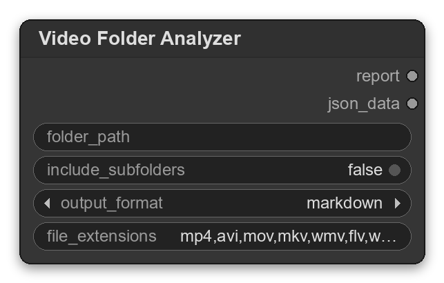

Scans directories for video files and generates detailed reports including resolution, frame rate, codec, duration, and file size. Outputs as text, JSON, or markdown.

**Latest Video Last N Frames**

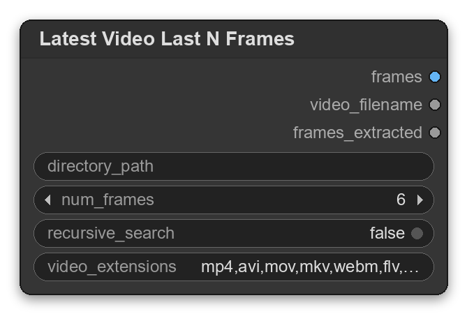

Extracts the final N frames from the most recently modified video in a specified directory. Useful for monitoring render outputs.

**Latest Video Final Frame**

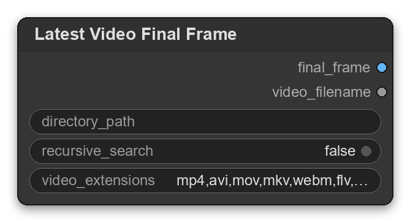

Retrieves the last frame from the newest video file in a folder. Streamlines iterative video generation workflows.

**Cross Dissolve with Overlap**

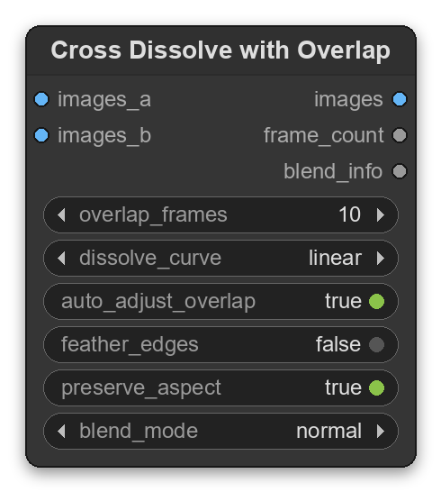

Creates smooth frame transitions with configurable overlap duration. Blends adjacent frames for professional video effects.

**Batch Slowdown**

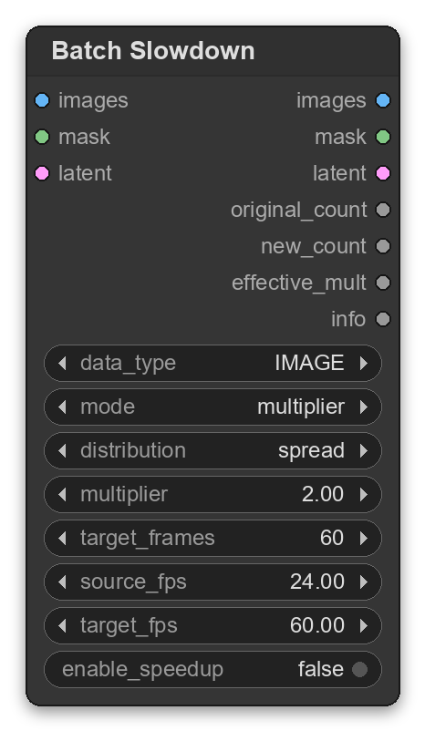

GPU-accelerated frame duplication to slow down image, mask, or latent batches. Supports multiple input modes: direct multiplier (2x, 3x, 1.5x), target frame count, or FPS conversion (24fps to 60fps). Features smart decimal distribution for non-integer slowdowns and optional speedup mode for sampling every Nth frame.

**Frame Ramp Boogie**

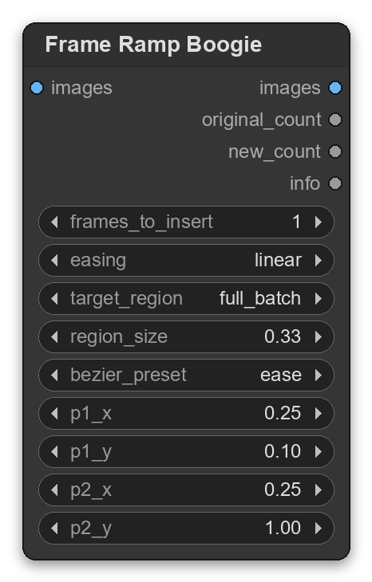

GPU-accelerated frame interpolation that inserts blended intermediate frames between consecutive frame pairs. Features configurable easing curves (linear, ease in/out, cubic bezier with presets) and region targeting (full batch, start, middle, end). Creates smooth slow-motion with actual frame blending instead of simple duplication.

**Save Transparent Video**

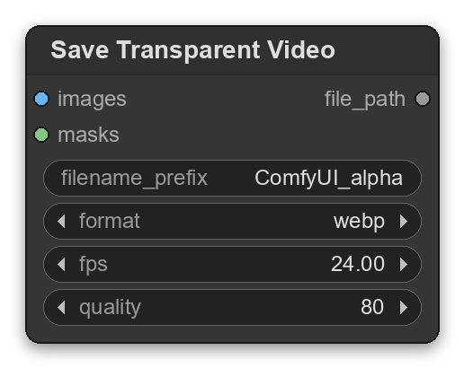

Export image batches as video with alpha channel transparency. Three output formats: Animated WebP (good compression, browser-ready), ProRes 4444 MOV (lossless for DaVinci Resolve / After Effects), and PNG image sequence (universal lossless fallback). Alpha is sourced from an optional MASK input, the 4th channel of RGBA images, or defaults to fully opaque. Supports mask auto-resize, single-mask-to-batch broadcast, and configurable quality/FPS. All alpha compositing is GPU-accelerated.

**Video Folder Cowboy**

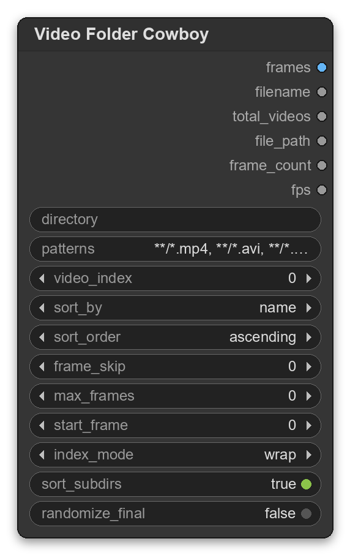

Directory iterator for video files with natural sorting (vid1 < vid2 < vid10). Browse folders with a built-in file browser dialog, load frames via OpenCV with configurable frame skipping, max frame limits, and start frame offset. Supports glob patterns, sorted subdirectory processing, and configurable index overflow handling (wrap, clamp, error). Returns frames as IMAGE batch plus filename, total video count, file path, frame count, and FPS.

**MatAnyone Video Matte**

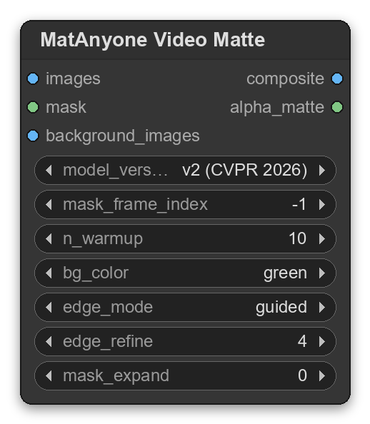

Temporally-consistent video matting using MatAnyone (CVPR 2025). Given a single initial mask (or auto-generated via BiRefNet), propagates it across all video frames with memory-based temporal consistency. Produces flicker-free alpha mattes for compositing over chroma key or custom backgrounds. All compositing is GPU-accelerated via torch.lerp.

**CorridorKey Green Screen Keyer**

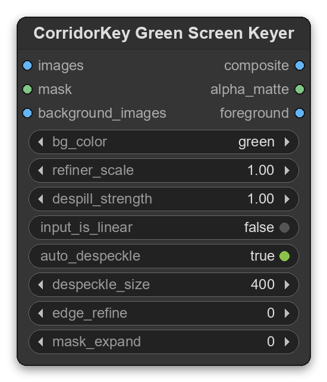

Neural green screen keying using CorridorKey (Corridor Digital). Instead of producing binary masks, it unmixes true foreground color from the green background, preserving semi-transparent details like hair, motion blur, and out-of-focus edges. Outputs clean straight foreground color, a linear alpha matte, and a composited preview. Uses BiRefNet for automatic alpha hint generation when no mask is provided. Features CNN refiner control, green spill removal, auto-despeckle for tracking markers, edge feathering, and mask expansion. Supports custom background images, transparent RGBA output, and multiple chroma key colors (green, blue, aqua, white, black).

**Video Degradation**

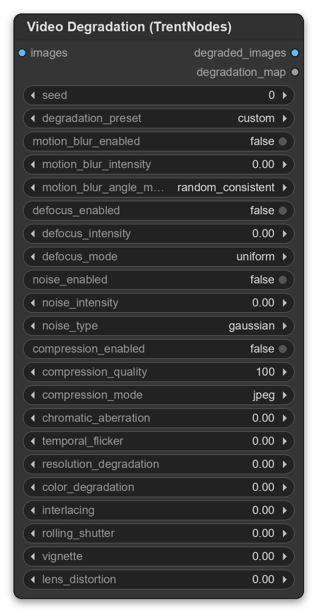

Apply configurable, temporally coherent degradation to video frame batches for generating synthetic training pairs. 15 built-in presets (mild, moderate, severe, phone_indoor, social_media_reupload, zoom_call, dashcam, night_handheld, old_youtube, old_vhs, shaky_handheld, security_cam, livestream, old_film, underwater) or full custom control. Supports motion blur (directional with angle modes), defocus blur (uniform, breathing, rack focus, edge softness), noise (gaussian, poisson, film grain, sensor, mixed), compression artifacts (JPEG, H.264, blockiness), chromatic aberration, temporal flicker, resolution degradation, color degradation, interlacing, rolling shutter, vignette, and lens distortion. Outputs degraded frames plus a JSON degradation map. All operations GPU-accelerated.

### 🎬 Trent/Compositing (1 node)

**Video Layer Ho Down**

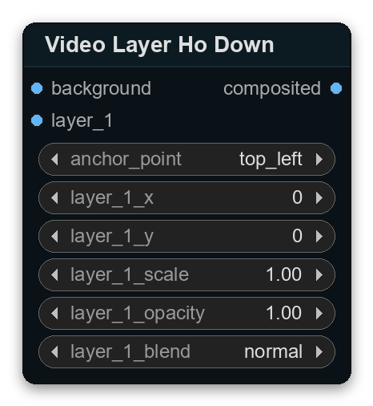

Multi-layer compositing node with interactive drag-to-position canvas preview. Place up to 5 transparent foreground layers onto a background image or video batch. Dynamic layer inputs -- connect one and the next appears automatically (up to 5). Each layer has independent scale, opacity, and blend mode (normal, multiply, screen, overlay, add). Supports RGBA 4-channel images for transparency, automatic batch size alignment (single frame layers repeat across entire video), and partial off-screen placement. All compositing is GPU-accelerated via PyTorch. Features a live canvas with checkerboard transparency indicator, click-to-select layers, drag-to-position, crosshair alignment guides, coordinate display, and a center-reset button.

### 🎨 Trent/PSD (6 nodes)

**PSD Layer Splitter**

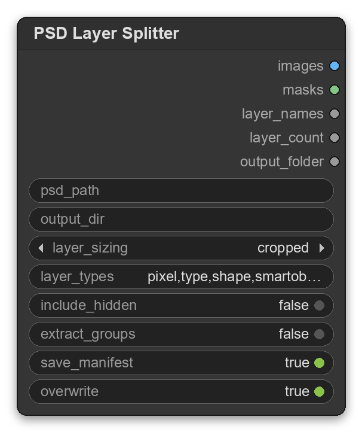

Rasterizes a `.psd` into per-layer PNGs and writes a `_manifest.json` capturing index, position, size, opacity, blend mode, visibility, group path, and (v2) `bbox_area_ratio`, `covers_canvas`, `is_fully_opaque` for downstream tools. Supports `canvas` or `cropped` layer sizing, optional group extraction, hidden-layer inclusion, and per-kind filters (pixel, type, shape, smartobject, fill, group, adjustment).

**PSD Layer Loader**

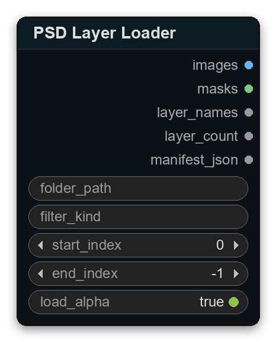

Loads previously-split layers from a folder (the splitter's output) without re-rasterizing. Use this when iterating on downstream nodes — skips the slow PSD parse. Range-selects via `start_index` / `end_index`, optionally loads alpha as a separate mask.

**PSD Layer Compositor**

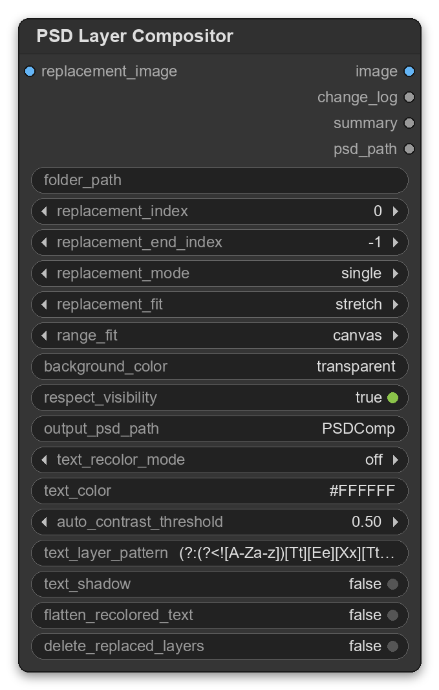

Recomposites layers from a splitter folder back into a single image, reading positions/opacity/visibility from `_manifest.json`. Three replacement modes for swapping out a background: **single** (swap one layer by index), **replace_range** (swap a contiguous index range with one image — for messy PSDs where the "background" is multiple stacked layers), and **underlay** (paste replacement under all originals as an escape hatch). `replacement_fit` (stretch/fit/cover/center) and `range_fit` (canvas/union_bbox) control sizing. Optionally re-exports a modified `.psd` via `output_psd_path` (single mode only in v1).

**PSD Background Detect**

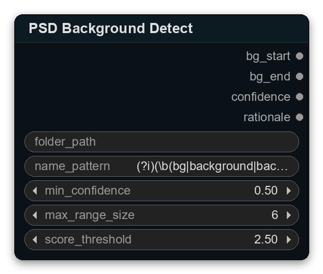

Scores layers from a `_manifest.json` and recommends a contiguous index range that's likely the background. Signals: name regex match (`bg|background|backdrop|sky|wall|floor` by default), full-canvas coverage, opacity + normal blend mode, bbox area ratio, bottom-bias; penalises text and adjustment layers. Outputs `bg_start`, `bg_end`, `confidence`, and a human-readable `rationale` you can wire to `easy showAnything` to see exactly which layers were picked and why. Wire `bg_start`/`bg_end` into the compositor's `replacement_index`/`replacement_end_index` and switch the compositor to `replace_range` mode for a fully-automated background swap.

**PSD Layer Names**

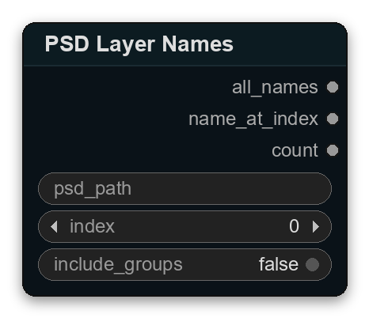

Lists every layer name in a `.psd` file — no rasterization, no manifest side-effects, just walks the layer tree. Use this to find the exact `target_layer_name` to feed `PSDLayerSaveAsPSD`. Optional group inclusion and group-path display.

**PSD Layer Save As PSD**

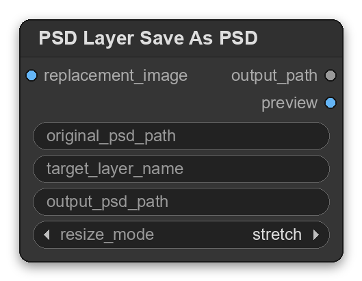

Replaces one layer's pixels in an existing `.psd` with a provided image and saves to a new path (the original is never overwritten). Locates the layer by name (recursively walks groups), preserves the original layer's name, opacity, blend mode, and visibility, and respects non-Latin layer names through the proper Unicode tagged block.

#### Recommended workflow for messy PSDs

When the "background" isn't a single clean layer, ladder through the three modes:

1. **Detect → range** — wire `PSDBackgroundDetect` to the compositor's `replacement_index`/`replacement_end_index`, set mode to `replace_range`. The detector's `rationale` output (piped to `easy showAnything`) shows which layers it picked and why, so you can sanity-check the call.
2. **Manual range** — if the detector misfires, leave the mode as `replace_range` and type the indices directly. The detector is a convenience, not a dependency.
3. **Underlay** — when you genuinely can't pin down a range, switch to `underlay`. The replacement paints under all originals and you toggle visibility on the offending opaque layers in the source PSD.

### 🎞️ Animation/Timing (2 nodes)

**Enhanced Animation Timing Processor**

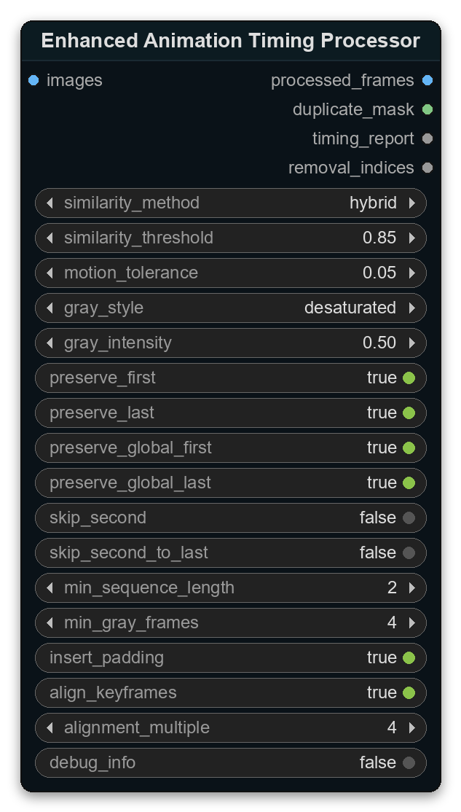

Analyzes animation sequences to detect duplicate frames and replaces them with gray frames for video generation workflows. Features multiple similarity detection methods (hybrid, SSIM, histogram, perceptual), configurable preservation options for sequence first/last frames, and **keyframe alignment** that automatically inserts padding frames to ensure keyframes land on multiples of 4 (or any configurable multiple) for glitch-free video generation. Outputs include processed frames, duplicate mask, timing report, and removal indices for the companion Frame Remover node.

**Animation Frame Remover**

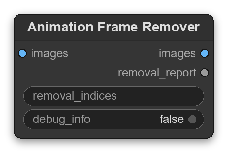

Removes padding frames inserted by the Enhanced Animation Timing Processor. Connect the `removal_indices` output from the processor to automatically strip the temporary padding frames after video generation, returning to the original frame count while preserving the generated content.

### 🖼️ Trent/Image (14 nodes)

**Image+Text Grid**

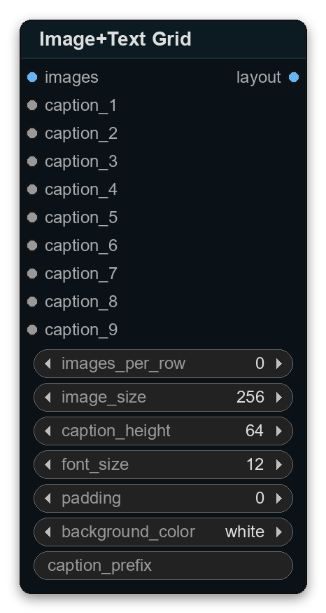

Creates a grid layout of images with text captions below each. Features auto-grid layout (set images_per_row to 0) that picks optimal columns via ceil(sqrt(n)), aspect-aware cell sizing based on median batch aspect ratio, and automatic centering of the last row when it has fewer images. Configure grid layout with images per row, image size, caption height, font size, padding, and background color. Note: when receiving images from a list-based node (e.g. StringListCowboy), use an ImageListToImageBatch node upstream to collect all images into a single batch before the grid. Perfect for contact sheets, comparison grids, or captioned image galleries.

**Align Stylized Frame**

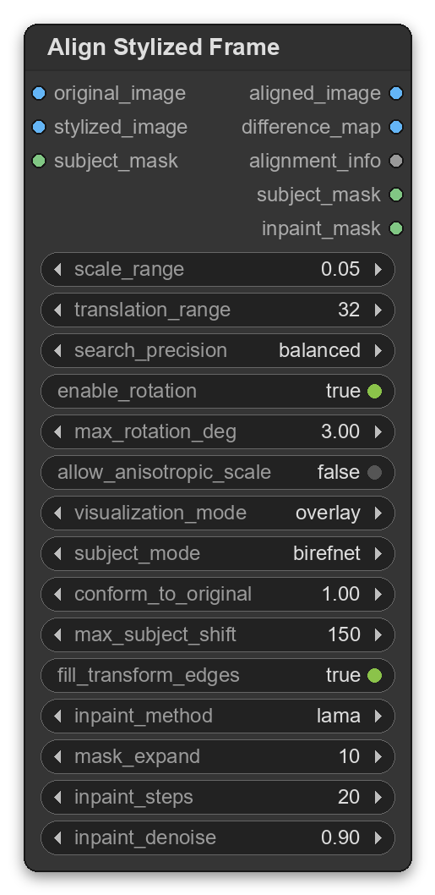

Aligns AI-stylized images (Flux img2img restyles etc.) back to their original source frame. Global alignment uses differentiable affine estimation — FFT phase-correlation seeding plus Adam refinement on contrast-normalized edge maps — recovering translation, scale, and optionally rotation and anisotropic scale to sub-pixel precision, with an ECC fallback that guarantees the output is never worse than the input. Subject-preserving mode uses BiRefNet for segmentation, DWPose shoulder matching (centroid/area fallback for non-person subjects), and pastes the untouched stylized subject at the corrected position. Ghost removal and border-gap fills use **big-lama** by default (purpose-built removal model, Apache-2.0, ~196MB auto-download from GitHub, single forward pass) with **Netflix VOID** (Apache-2.0, via ComfyUI core, weights in standard model folders) selectable as a diffusion option — note VOID is a video model run on a replicated 5-frame clip for stills, is much slower, and in testing LaMa matched or beat it on single frames; VOID is the intended engine for future video-batch fills. The old `sd_inpaint` option maps to `lama` automatically (SD 1.5 backend removed). The `score_map` visualization shows per-pixel alignment residual before/after. Notes: the difference_map output is a 2x-wide side-by-side diagnostic image, not a same-size frame; with `inpaint_method=none` the inpaint_mask output excludes the pasted subject so it is safe for an external inpainting pass; batches use frame-0 geometry for all frames.

**Cherry Pick Frames**

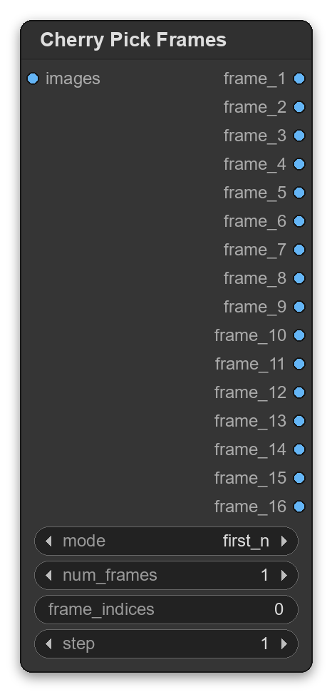

Flexible frame selector with multiple modes for extracting specific frames from image batches. Supports first N frames, last N frames, specific indices (comma-separated like "0,5,10,75"), or every Nth frame. Dynamic outputs adjust based on your selection. Perfect for grabbing keyframes, endpoints, or evenly-spaced samples from video batches.

**Bevel/Emboss Effect**

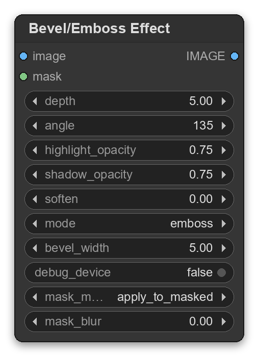

Applies depth and dimensionality to images through configurable bevel and emboss filters. Includes adjustable angle, depth, and smoothing parameters.

**Image Batch Analyzer**

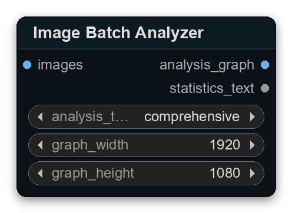

Comprehensive statistical analysis of image batches. Generates histograms, color distribution charts, and detailed reports on brightness, contrast, and color composition.

**Multi-Batch Combine**

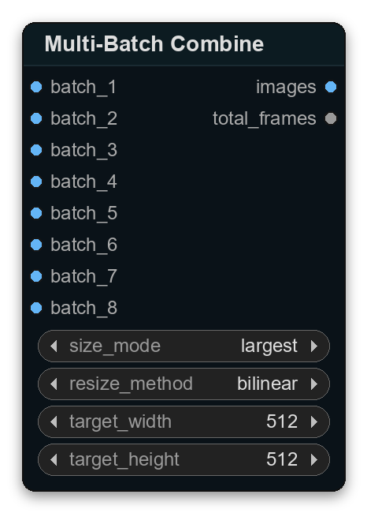

Concatenates multiple image batches into a single output batch. Accepts up to 8 optional inputs - unconnected inputs are simply skipped. Handles dimension mismatches automatically with configurable resize modes: largest (resize all to max dimensions), first (match first batch), or custom (specify target width/height). GPU-accelerated resizing via bilinear, nearest, bicubic, or area interpolation.

**Black Bar Cinema Scope**

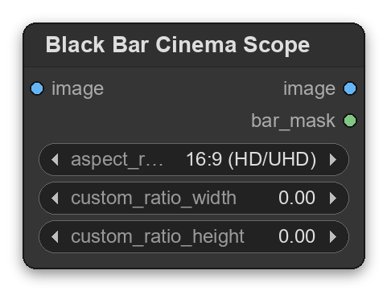

Adds cinematic black bars (letterbox/pillarbox) to images for widescreen aspect ratios. Supports standard presets (16:9, 2.35:1 Cinemascope, 2.39:1 Anamorphic, 2.76:1 Ultra Panavision, etc.) plus custom ratio override. GPU-accelerated.

**Image Folder Cowboy**

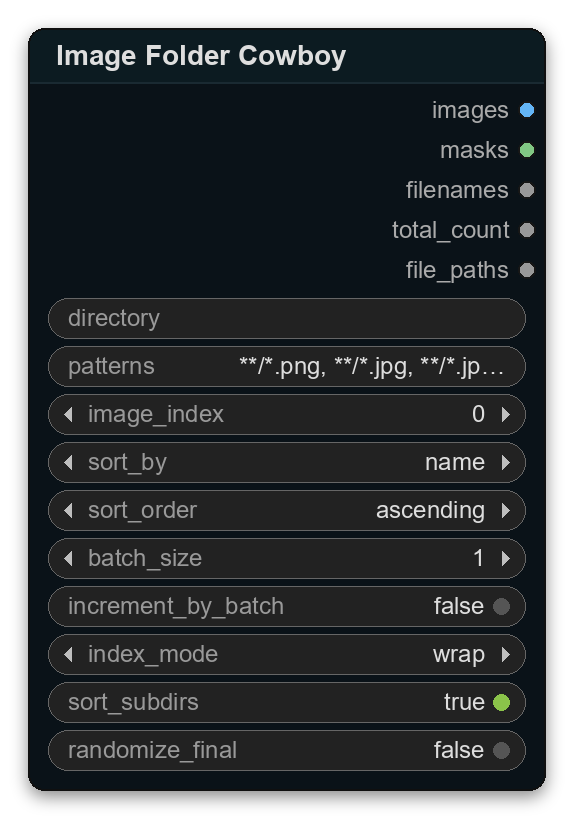

Directory iterator that loads images with proper natural sorting (img1 < img2 < img10). Fixes common issues with filename ordering by splitting text and numeric chunks. Features configurable index overflow handling (wrap, clamp, error) and sorted subdirectory processing.

**Easiest Green Screen**

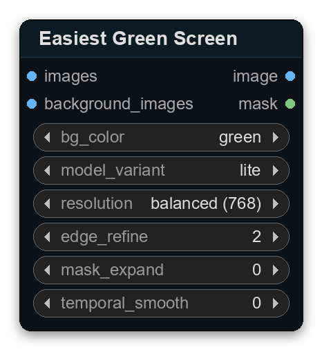

One-click background removal and chroma key replacement using BiRefNet AI segmentation. Composites foreground over a solid color background (green, blue, aqua, white). Features edge refinement with dilate/erode/feather controls, temporal smoothing for flicker-free video batches, optional custom background images, and resolution presets (512/768/1024). All operations GPU-accelerated.

**Grab First Frame**


Returns the first frame from a batch of images. One input, one output, zero settings.

**Just Pad or Crop It**

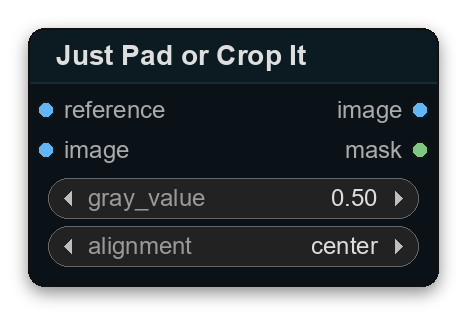

Pad or crop an image to match a reference image's dimensions. Each axis is handled independently: axes smaller than the target are padded with configurable gray fill, axes larger are center-cropped. Outputs a binary mask (1.0 = real pixel, 0.0 = padded region). Supports center or top-left alignment.

**Multi-Load Cowboy**

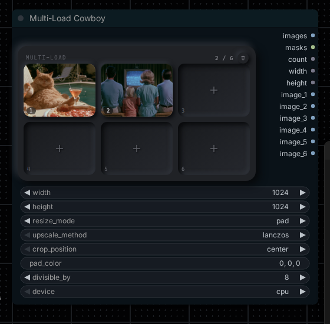

Six image loaders in one node, with one shared resize. The node face is a grid of slots sitting beside the output column, so eleven outputs cost no extra height: click a slot to browse the input folder or upload, drop files straight onto a slot, drag one slot onto another to swap, and clear a slot with the X in its corner. Dropping several files at once fills the empty slots in order. Empty slots are skipped instead of raising, so a half-filled grid is a valid graph and an all-empty grid still returns a black frame plus a count of 0. Resizing follows the same fit modes as KJ's Resize Image V2 - stretch, resize, pad, pad_edge, crop and total_pixels - with crop position, pad colour and a divisible_by rounding. Outputs the filled slots as one batch (padded up to a common size when a fit mode leaves them uneven), the alpha masks with padding marked as 1.0, the count, the batch width and height, and each slot on its own IMAGE output for wiring to separate branches.

**Ref Folder Cowboy**

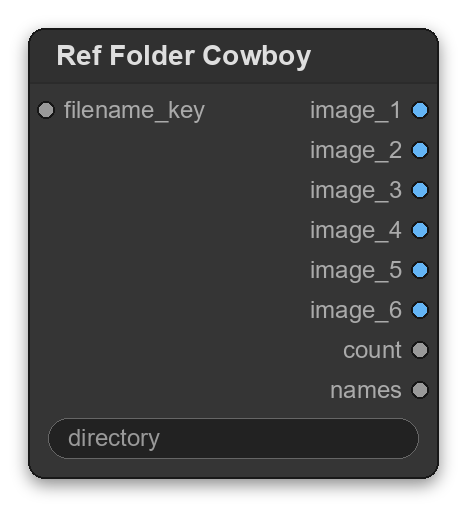

Loads up to six reference images from a folder (or folder/<filename_key>/) onto six fixed IMAGE outputs in natural-sort order. Empty slots output None, which optional inputs - like the MiniMax H3 ref_image sockets - treat as not connected, so all six outputs stay wired and nothing needs muting. An empty or missing folder is not an error: every slot passes None and the run continues ref-less. Also outputs the image count and the slot-order filenames. Replaced ref files bust the cache via mtime.

**Ref Preview Cowboy**

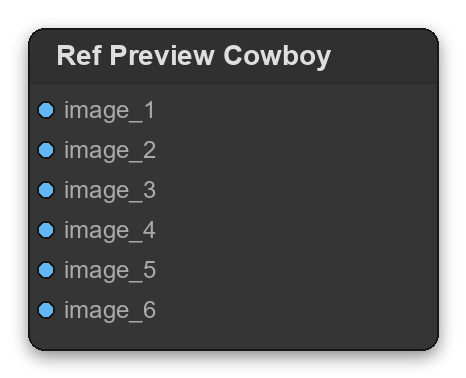

None-tolerant multi-image preview, the companion to Ref Folder Cowboy. Six optional IMAGE inputs; previews whichever slots hold images, in slot order, and silently skips None or unconnected inputs - so an empty or partial ref folder never aborts the run. Each slot is saved separately, so mixed image sizes are fine.

### 🔧 Trent/Utilities (14 nodes)

**Save for Next Time**

Stashes data in a named slot so a *later* queue run can pick it up. Connect any mix of IMAGE, MASK, STRING, AUDIO, VIDEO and LATENT — whatever arrives together becomes one entry under `output/for_next_time/<slot_name>/`. Keeps the newest `max_entries` saves (default 10) and deletes the rest.

Entries are published by an atomic folder rename, so a run killed mid-save never leaves a half-written entry. Rename an entry folder by hand to something without the `00000001-` prefix and it becomes a permanent pin: still reachable by name, never pruned.

Has no outputs on purpose — wire your data to this node *and* to whatever else needs it.

**Take from Last Time**

Reads back what Save for Next Time stashed on an earlier run. Defaults to the most recent entry; set `steps_back` to reach further back (1 = the one before newest), or type an `entry_name` (a unique prefix is enough) to pin an exact entry.

Sockets the chosen entry holds no data for are *blocked*, so only the branches that need a missing member get skipped — the rest of the graph runs normally. `found`, `entry_name` and `entry_count` always report, so you can branch on them. `fallback_mode` decides what happens when the slot is empty or `steps_back` overruns: `block` (default), `empty` (blank values), or `error`.

Save and Take on the same slot in the *same* prompt is not supported — ComfyUI does not order two unconnected nodes. The pair is for consecutive runs.

**Smart File Transfer (Auto-Rename)**

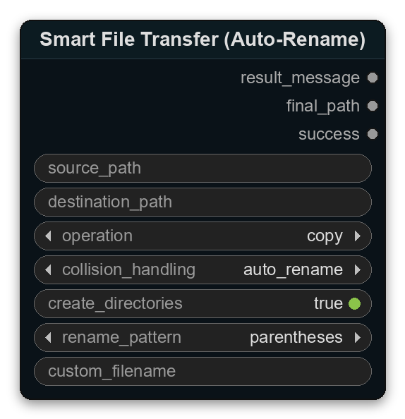

Intelligent file management with automatic conflict resolution, checksums, and organized directory structures. Safely transfers files with duplicate detection.

**Custom Filename Generator**

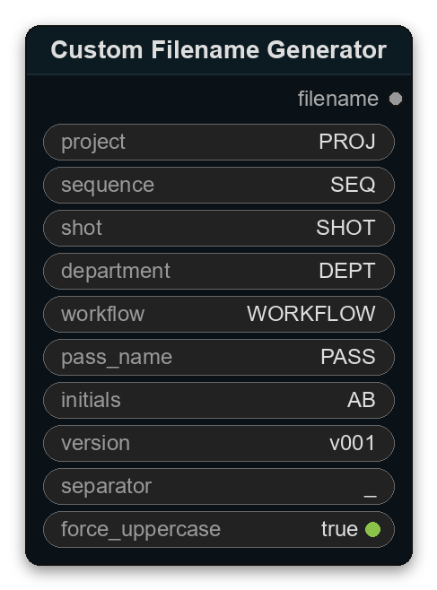

Creates structured filenames using templates with support for timestamps, counters, and metadata variables. Ensures consistent file naming across workflows.

**Filename Extractor**

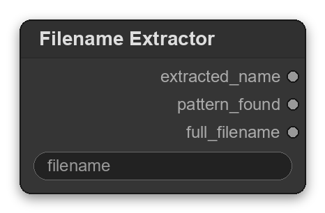

Parses filenames to extract embedded metadata, timestamps, and structured information. Converts filenames into usable workflow data.

**JSON Multi-Line Summary**

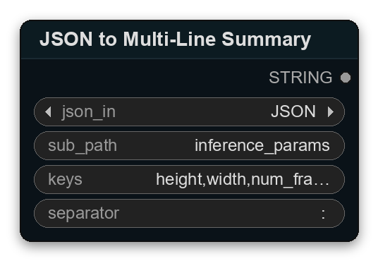

Converts complex JSON data into human-readable multi-line summaries. Formats nested structures for display and logging.

**JSON Extractor**

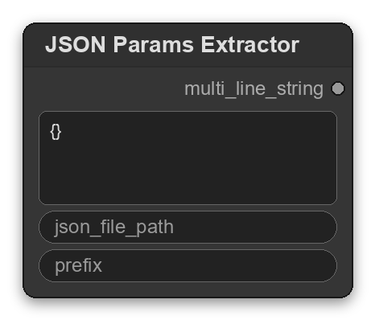

Extracts specific values from JSON objects using path notation. Simplifies working with structured data in workflows.

**Number Counter**

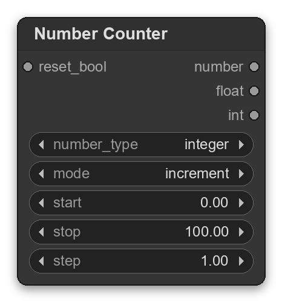

Generates sequential numbers with configurable start, step, and padding. Essential for batch processing and frame numbering.

**Text File Line Loader**

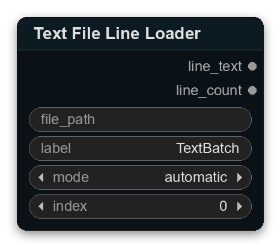

Loads individual lines from text files by index. Useful for iterating through prompt lists or configuration files.

**File List**

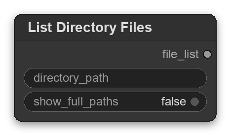

Lists files in a directory with filtering options. Returns file paths for batch processing workflows.

**Create Text File**

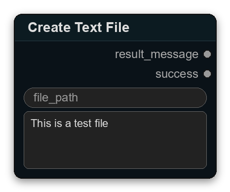

Creates text files with custom content. Specify a file path and content to write. Automatically adds .txt extension if none provided. Creates parent directories as needed.

**Wan2.1 Frame Adjuster**

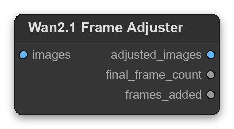

Adjusts frame amount to always satisfy Wan 4x+1 requirements by adding gray frames to the end of a batch; use a Get Frame Range from Batch node before combining video with the original amount of frames for less headaches when using Wan.

**MiniH3 Magic (Frame Adjuster)**

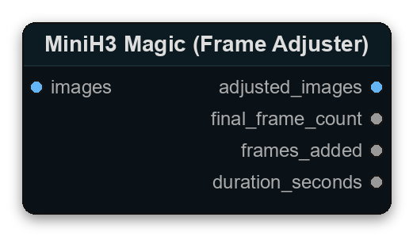

MiniMax H3 counterpart of the Wan2.1 Frame Adjuster. Rounds a batch up to the next valid H3 frame count (17n+5: 5, 22, 39, 56, ...) by adding gray frames to the end, and also outputs the resulting duration in seconds at H3's native 24 fps. H3 can pad up to 16 frames (~0.67 s), so trim back to the original frame count after generation.

**WSL Path Converter**

Turns a Windows path into the Linux path a ComfyUI running under WSL can actually open, so pasted paths work in Load Video (Path), Load Image From Path and friends. Handles `\\wsl.localhost\<distro>\...` and legacy `\\wsl$\...` UNC paths, drive letters (`C:\Users\...` → `/mnt/c/Users/...`, honouring a custom `[automount] root` in `/etc/wsl.conf`), `file://` URIs, and quotes from Explorer's "Copy as path". Set `direction` to `to_windows` to go the other way, or leave it on `auto` to always get the host's native form. The optional `append` input joins a file name onto a folder, and the `exists`/`kind` outputs report whether the target is a file, a dir, or missing.

### 🎭 Trent/Masks (4 nodes)

**Latent Aligned Mask**

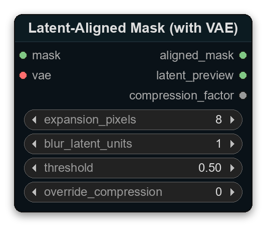

Creates precision masks aligned to latent space dimensions. Ensures proper mask scaling for latent-based video and image processing.

**Latent Aligned Mask (Advanced)**

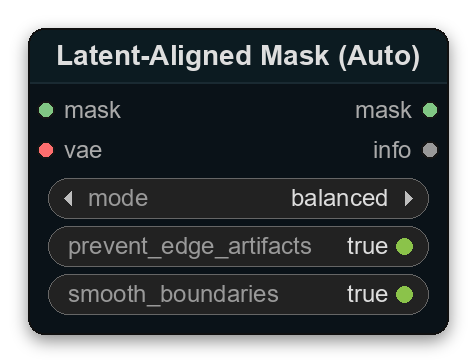

Extended version with additional parameters for fine-tuned mask generation including feathering, inversion, and composite operations.

**Latent Aligned Mask (Simple)**

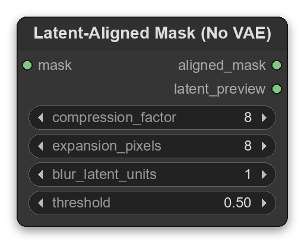

Streamlined mask creation with minimal inputs for quick latent-aligned masks in simple workflows.

**Latent Aligned Mask (Wan)**

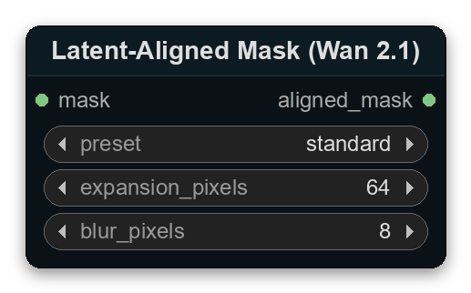

Specialized variant optimized for Wan video model requirements with automatic 4x+1 frame alignment.

### 🎬 Trent/Keyframes (2 nodes)

**Wan Vace Keyframe Builder**

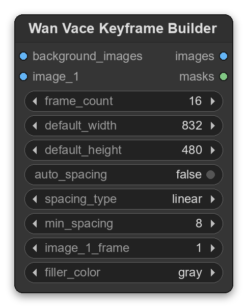

Dynamic keyframe sequencing for Wan Vace video generation. Features interactive UI with drag-and-drop image inputs, frame-accurate positioning, automatic resizing, and synchronized mask generation. Supports up to 256 frames with customizable filler frames.

**Vace Mask AutoComping**

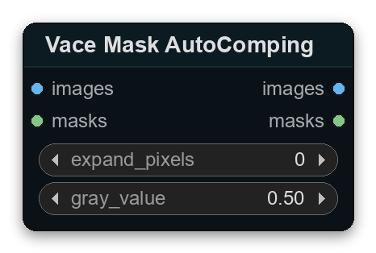

Composites solid gray over masked areas of input images for Wan VACE inpainting workflows. Feed in an image batch and a mask batch (e.g. from SAM3), and it outputs the original video with gray overlaid on the masked regions plus a matching clean binary mask -- saving you from manually compositing the gray-over-original setup that VACE expects. Features adjustable mask expansion (hard edge, no feather) to grow the inpaint region, and a configurable gray level (default 0.5 matches VACE filler). Handles single-mask-to-batch broadcast, automatic spatial resizing, and GPU-accelerated dilation.

### 📝 Trent/Text (3 nodes)

**Auto Style Dataset**

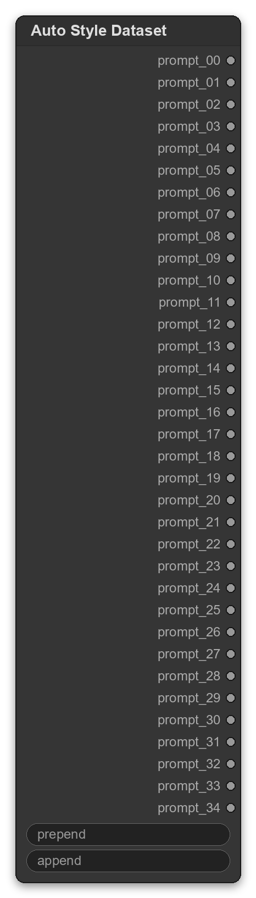

Generates 35 prompt strings for synthetic dataset creation. Reads prompts from an external config file and applies optional prepend/append text to each output. Perfect for batch generation of training data with consistent formatting.

**String List Cowboy**

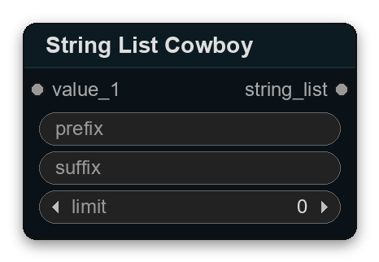

Lassos strings together into a list with optional prefix/suffix branding. Works like Impact Pack's MakeAnyList but specialized for strings - connect any inputs and they get collected into a string list. Each string gets the prefix prepended and suffix appended. Dynamic inputs expand as you connect more values.

**Text File Cowboy**

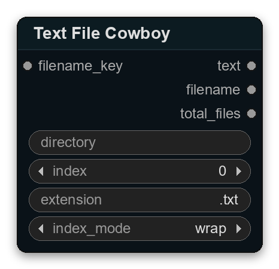

Directory iterator for text files - the prompt-side companion to Video/Image Folder Cowboy. Loads one file selected by index (natural-sorted, with wrap/clamp/error overflow modes) or by a filename_key input: wire VideoFolderCowboy's filename output in and clip 000.mp4 loads prompts/000.txt. Outputs the file text, the bare filename, and the total file count. Edits to the file bust the cache automatically via mtime.

### 🔀 Trent/Flow (2 nodes)

**This, That, or The Other**

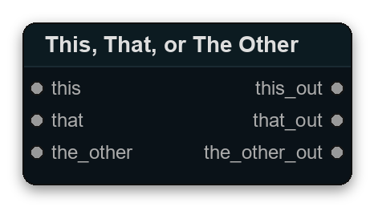

Parallel gating node with 3 independent input/output channels. Each input passes to its corresponding output ONLY if truthy (non-None, non-zero, non-empty). Falsy inputs block their downstream path via ExecutionBlocker. Uses lazy evaluation to avoid evaluating inputs until needed. Dynamic inputs expand as you connect (1-3 slots).

**First Valid**

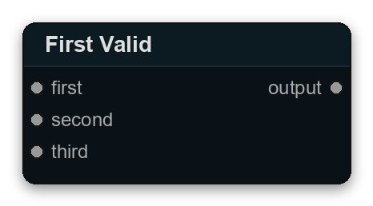

Fallback chain node that outputs the FIRST truthy value. Checks inputs in priority order: first → second → third. Returns the first truthy value found, or blocks if all are falsy. Uses lazy evaluation to skip evaluating later inputs once a truthy value is found. Perfect for providing fallback values like default images, prompts, or parameters.

### 🧪 TrentNodes/Testing (1 node)

**LoRA Test Prompt Generator**

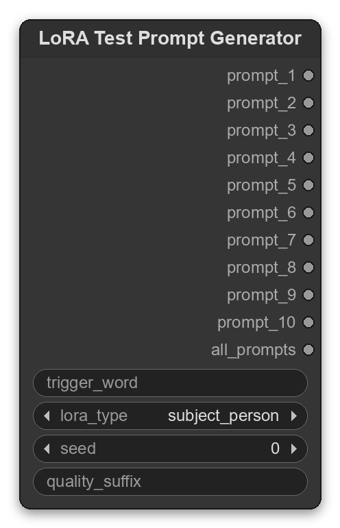

Generates 10 test prompts specifically designed to validate different types of LoRA models. Supports four LoRA categories:
- **subject_person**: Portrait/character LoRAs with varied lighting, poses, and environments
- **style**: Artistic style LoRAs across diverse subjects and scenes
- **product**: Object/product LoRAs with studio and lifestyle contexts
- **vehicle**: Car/vehicle LoRAs covering angles, lighting, and motion

Outputs 10 individual prompt strings plus a combined `all_prompts` output for easy batch processing. Includes optional quality suffix to append tags like "8k, detailed" to all prompts.

### 👁️ Trent/VLM (13 nodes)

**H3 Audio Soundscaper (Local GGUF)**

Hears a clip's audio track with a local omni model (built for Qwen3-Omni-30B GGUF under llama-server) and writes the audio parts of a MiniMax H3 prompt: a skill-budgeted `overall_soundscape` (1-4 sentences, diegetic only), `non_diegetic_music` (1-3 sentences or N/A), verbatim `dialogue` lines ready for `<d>` tags, and a full timestamped sound-design log. An optional `scene_context` input tells it what is on screen, used only to sort diegetic from non-diegetic.

**Design mode** — leave `audio` unconnected and fill `video_prompt` with an H3 prompt (or any scene description) and the node flips from transcribing to inventing: same four sections, but now a sound designer's plan for the described visuals, cue sheet keyed to the prompt's shots, dialogue copied verbatim from the prompt (never invented — H3 renders `<d>` words literally). No mmproj needed in this mode, so any chat GGUF works, including attaching to the promptor's server on 8735 via `base_url`. With audio connected, `video_prompt` instead rides along as extra scene context.

Runs on its own llama-server port (8736) so it coexists with the H3 Skill Promptor's text-VLM server (8735) — the server manager is per-port. Same contract as the promptor: one corrective retry against the output rules, never a silent rewrite, everything reported. The model is told the clip's exact duration and to ignore analysis-window padding (every audio captioner tested fabricates events past the real clip end otherwise).

**Models** (put both files in `models/LLM`, from [ggml-org/Qwen3-Omni-30B-A3B-Instruct-GGUF](https://huggingface.co/ggml-org/Qwen3-Omni-30B-A3B-Instruct-GGUF)):
- [`Qwen3-Omni-30B-A3B-Instruct-Q4_K_M.gguf`](https://huggingface.co/ggml-org/Qwen3-Omni-30B-A3B-Instruct-GGUF/blob/main/Qwen3-Omni-30B-A3B-Instruct-Q4_K_M.gguf) (~17.3 GB, MoE — only ~3B active)
- [`mmproj-Qwen3-Omni-30B-A3B-Instruct-Q8_0.gguf`](https://huggingface.co/ggml-org/Qwen3-Omni-30B-A3B-Instruct-GGUF/blob/main/mmproj-Qwen3-Omni-30B-A3B-Instruct-Q8_0.gguf) (~1.2 GB — carries the AUDIO encoder; required)

**H3 Skill Promptor (Local GGUF)**

Writes an official MiniMax H3 prompt (Ref2VA six-section or any of the four base three-field modes) with a local GGUF vision LLM - built for Qwen3.8-27B + its mmproj, served by a managed `llama-server` process. Fully offline: no API keys, no cloud.

**The skill is the system prompt.** Instead of a hand-maintained prompt, the node loads the `h3-prompting` skill document itself (live from `~/.claude/skills/h3-prompting/SKILL.md`, falling back to a vendored snapshot) and sends it as the spec, together with exactly one of MiniMax's own worked examples for the selected mode. Update the skill and the node follows.

**No silent rewrites.** Output is checked against the skill's review checklist by a deterministic validator (`utils/h3_skill/checklist.py`). Violations go back to the model once, with the numbered error list; whatever comes back is returned as-is with a full `validation_report`. The only pipeline-side additions are the transport cleanups it reports (a stripped code fence or leaked `<think>` block) and the base-mode alignment line, which per the guide is rendered after the body exists.

**The server is managed for you.** Pick a `.gguf` from `models/LLM` in the dropdown; the mmproj pairs by filename. The node spawns `llama-server` on port 8735 with the right flags for this family (`--jinja`, Unsloth instruct sampling, `reasoning_effort` via chat_template_kwargs), health-checks it, reuses it across runs, and refuses to spawn when free VRAM is too low. `base_url` attaches to any OpenAI-compatible server instead (LM Studio, vLLM, a llama-server you started by hand). Needs a current CUDA build of llama.cpp — see the comment block in `requirements.txt`.

**Models** (put both files in `models/LLM`, from [unsloth/Qwen3.8-27B-GGUF](https://huggingface.co/unsloth/Qwen3.8-27B-GGUF) — grab the current "UD V3.0" upload):
- [`Qwen3.8-27B-UD-Q4_K_XL.gguf`](https://huggingface.co/unsloth/Qwen3.8-27B-GGUF/blob/main/Qwen3.8-27B-UD-Q4_K_XL.gguf) (~16.4 GB)
- [`mmproj-F16.gguf`](https://huggingface.co/unsloth/Qwen3.8-27B-GGUF/blob/main/mmproj-F16.gguf) (~0.9 GB — the vision encoder for image inputs; rename it next to the model, e.g. `Qwen3.8-27B-mmproj-F16.gguf`, or let auto-pairing pick it as the only mmproj in the folder)

Any current vision GGUF that llama.cpp serves works here; these are the pair the node was built and tested against (arch `qwen35` needs llama.cpp ≥ b10450).

**Ask Local LLM (GGUF)**

The H3 Skill Promptor's engine with the H3 contract removed: a general-purpose chat node over the same managed llama-server. Type a question, get an answer. Use it to write or refine prompts for any other model, describe attached images, summarize wired-in text, or brainstorm — the editable system prompt decides who the model is for that call.

**Zero-reload server sharing.** The defaults match the promptor's `ServerSpec` field for field (port 8735, ctx 32768, mmproj auto-paired), and the server manager respawns only when the spec changes — so if the promptor's Qwen3.8-27B is already resident, this node answers immediately, and vice versa. `reasoning_effort` is deliberately excluded from that comparison, so changing it never forces a reload. `base_url` attaches to any OpenAI-compatible server instead (LM Studio, vLLM, a hand-started llama-server).

**Multi-turn by wiring.** The `history_json` output carries the conversation as a readable JSON turn list; wire it into another Ask Local LLM node's `history_json` input to ask a follow-up with full context. History stays text-only — attached images become a `[N image(s) were attached]` note rather than re-sent base64, so chained turns don't balloon the context. Malformed history errors loudly instead of being silently dropped.

**Same guardrails as the promptor.** Thinking gets its own capped token allowance on top of `max_tokens` (low +2048 / medium +3072 / xhigh +7168), so a long think can never starve the visible reply; hitting the limit mid-think raises an actionable error instead of returning an empty string. A leaked `<think>` block is stripped and reported — but markdown fences are kept, since in a chat answer they're usually intentional code. The `info` output reports latency, token counts, and any warnings. Bump `seed` for a fresh answer to the same prompt (the node caches on identical inputs).

**H3 Local LLM Stop (free VRAM)**

Stops the managed llama-server (or an orphaned one a crashed session left behind). Process death releases all of its VRAM at once. Wire any upstream output into its `after` input to control when it runs — an output node with no inputs is scheduled *first* in the queue, which would kill the server before the promptor uses it.

**Ultimate H3 Cowboy Promptor**

Writes a MiniMax H3 prompt for any kind of shot, not just character replacement, and hands the assets straight on to the sampler. Where H3 Auto Prompt Generator does one job well (replace the performer in a video with the person in a reference image), this writes any job the H3 spec describes — and both are installed on purpose.

**Subjects are rows, not syntax.** Each row is a kind, an optional name, and a description. `character` and `environment` sit at the top of the kind list and become the guide's own `person` and `scene`; animal, object, wardrobe, interface, effect, style, action, expression and pose are all there too. Rows appear as you use them: fill the last one and the next arrives, wire `subject_4_image` and rows 1–4 are waiting. One rule runs the whole way through — **row N is `<Subject N>` is `subject_N_image` is `<Picture N>`** — so a skipped row leaves a hole rather than closing it, and says so. A row needs no image, which is how you ask for a style or an action. The typed `subjects` field is still there behind **Show advanced**, for the seventh subject or one citing two pictures at once.

**Two formats, one node.** `h3_mode` picks the skeleton. `ref` writes the six-section Ref2VA format from reference assets. The four `base_*` modes write the three-field base format — T2VA from text alone, I2VA from a first frame, FL2VA between a first and a last frame, L2VA onto a last frame — and need a different H3 checkpoint, which `h3_checkpoint_hint` names. All six of the guides' own worked examples pass this node with zero errors.

**`music_video`** is the same mode the older node has, rewritten for several subjects: the singer is whichever subject can actually sing, not an assumed `<Subject 1>`. `non_diegetic_music` becomes the lead audio section and can no longer be `N/A`, `overall_soundscape` thins to what is audible under the track, cuts land on the beat, and performance to camera becomes the action. `lyrics` reach a `<d>[Language] ...</d>` block in the shot where they are heard or the run retries; `music_source` decides whether the song is declared to H3 as `<Audio 1>`, which is what adds `audio reuse` to the task type.

**Nothing is wired twice.** The images, video and audio you plug in come back out as `ref_image_1..6`, `ref_video` (as IMAGE frames, which is what the sampler takes), `ref_video_audio` and `ref_audio`, with the `width`, `height` and `length` MiniMaxH3ReferenceToVideo wants and a `label_map` you can read against the prompt. The old five outputs never move. `length` sits on H3's 17k+5 frame grid, and `snap_duration_to_h3_grid` (on by default) makes the prompt state the duration that grid really produces — ask for 2.00 seconds and H3 renders 2.33.

Wire Cut Detective into `cut_times` to pin the shot timeline. Backends are the same seven as the older node.

**H3 Auto Prompt Generator**

Reads a source video plus an identity reference image with a VLM and writes a production-ready MiniMax H3 REF2VA prompt in the official six-section format. It picks keyframes on scene cuts and motion peaks, then validates and repairs the model's output, and retries once with the validator's error list. Backends: anthropic, gemini (the only one that can hear the audio track), openai, kimi, glm, qwen_api, and three local options.

**What "official format" means here.** Every rule the assembler enforces traces to MiniMax's own [`VIDEO_PROMPT_WRITING_GUIDE_ref_en.md`](https://huggingface.co/MiniMaxAI/MiniMax-H3/blob/main/docs/VIDEO_PROMPT_WRITING_GUIDE_ref_en.md) and `..._base_en.md`: the six lowercase sections in order, one line per reference label in `subject_definitions` and `retention_analysis`, the mandatory square-bracketed task-type prefix on `summary`, the fixed retention markers (`fully_preserved` / `partially_preserved` / `attribute_transfer` / `weak_reference` for visible content, `fully_copy` / `partially_copy` / `reference` / `weak_reference` for audio), `[Shot 1]` with no timestamp and `[Shot N] At MM:SS.mmm,` after it, and nothing at all after `non_diegetic_music`. `tests/test_h3_format.py` asserts each of these against the quoted rule.

Two things worth knowing:

- The trailing block of `No ...` sentences is **not** in the format — the word "exclusion" appears in none of MiniMax's guides. It is off by default and lives behind **`append_exclusions`**, because H3 has no negative-prompt field and some workflows lean on it. Run `--profile both_ab` in `tools/h3_prompt_dev_run.py` to A/B it.
- `non_diegetic_music: N/A` means "there is no non-diegetic music", so the length trimmer shortens a real score to its first sentence rather than blanking it.

Three controls decide how the references are read:

- **`cut_times`** — paste or wire any Cut Detective output here. The cut list becomes ground truth: keyframes land on the real shot starts, the VLM is told to write exactly those shots, and the assembler forces the `[Shot N]` times onto them instead of rescaling proportionally. A shot count that disagrees is a retry error, not a silent repair. Blank falls back to the node's own frame-difference guess.
- **`music_video`** — writes the prompt as a music video instead of a documentary scene. The audio balance inverts: `non_diegetic_music` becomes the lead section and can no longer be `N/A`, `overall_soundscape` thins to what is genuinely audible under the track, cuts are described as landing on the beat, and performance to camera becomes the action. Put the sung words in **`lyrics`** and the track in **`music_description`**. Lyrics are written as `<d>[Language] ...</d>` inside the shot where they are heard — the actual language of the words, not always English — and are stripped if the model repeats them in the audio sections, per the official guide. **`music_source`** decides whether the song reaches H3 itself: `auto` infers it from a connected `audio` input, `reuse_audio_1` declares it outright even with nothing wired, and `generate_score` has H3 invent the track. When it is reused the prompt declares `<Audio 1>` as the score with a `fully_copy` retention line and attributes the vocal to the track rather than a new `(Sx)` speaker ID. Leaving `lyrics` blank tells the model to say the mouth moves in time without intelligible words — H3 invents nonsense syllables if you ask for singing without giving it words. The mode overrides `enable_audio_prompt` when they clash, since a silent music video is a contradiction.
- **`first_frame_alignment`** — the I2V hook. H3 expects the picture-to-timeline relationship declared as the prompt's first line, and the guide fixes two sentences for it. At `alignment_time_seconds` `0.00` the node emits the I2VA form verbatim: `For the target video, at 0.00 seconds into the target video, <Picture 1> (from [Shot 1]) is fully referenced.` Any other moment uses the L2VA form, `How the reference pictures align with the target video - <Picture 1> (from [Shot N]) aligns with the S.SS-second mark of the target video.`, which is the one the guide writes with a variable shot and mark. Because that sentence declares `<Picture 1>` to *be* the target frame, the node reverses its usual stance: the task context tells the model to use the reference's framing, background and lighting, and the assembler strips any prose still saying to ignore them. Alignment also makes the aligned picture a genuine frame anchor, which is exactly when the guide wants it to have its own `subject_definitions` line and its own `([Shot N] first frame)` retention entry — so the node asks for both, instead of the usual rule of citing an identity-only image inside `<Subject 1>`.
- **`first_frame_image`** — for a **hybrid graph** that feeds H3 a character reference *and* an injected opening frame. Connect it and it becomes `<Picture 2>`: the alignment sentence pins *that* image to the timeline and Shot 1 opens on it, while `<Picture 1>` keeps its identity-only role and no shot ever opens on it. Wire the same image your H3 encoder gets in slot 2. This matters because a character reference is often a multi-angle sheet — without this input, turning on `first_frame_alignment` tells H3 that the contact sheet *is* the opening frame. The prose repair follows the aligned tag too, so `<Picture 1> supplies identity only` stays intact in a hybrid run and is stripped in a single-picture one, which is correct in both cases.

Leave `first_frame_alignment` **off** for REF2VA character replacement, where `<Picture 1>` supplies identity only and its background must not leak into the video.


**VidScribe MiniCPM Beta**

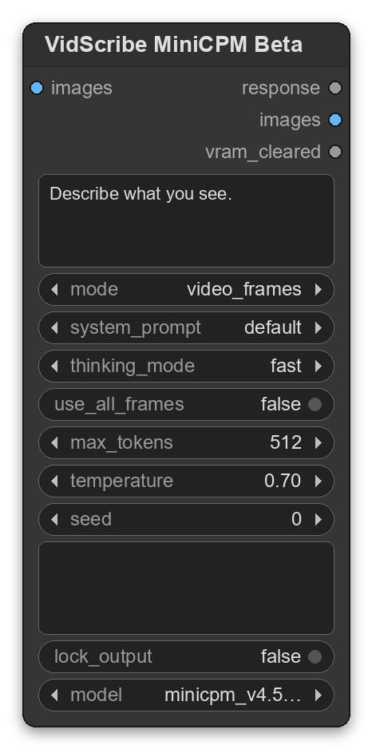

GPU-accelerated vision-language model for describing images and video frames. Two selectable backends: MiniCPM-V 4.5 int4 (default) and Microsoft Mage-VL 4B (Jul 2026, stronger on video; ~10GB bf16, auto-downloads to models/magevl; thinking_mode is MiniCPM-only). Features:
- int4 quantization (~6-8GB VRAM)
- Smart frame sampling (auto-selects ~32 frames from longer videos)
- Auto-unload after 60s idle to free VRAM
- System prompt presets (default, detailed, concise, narrator, technical, accessible, creative)
- Three modes: single image, multi-image comparison, video frame sequence with temporal understanding
- Deep thinking mode for more thorough analysis

**Unload MiniCPM**

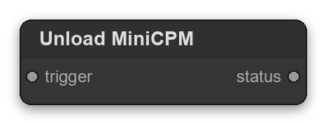

Manually unload MiniCPM model to immediately free VRAM. Connect any output to trigger. Useful when you need GPU memory for other operations without waiting for the 60-second auto-unload timeout.

**VRAM Gated Checkpoint Loader**

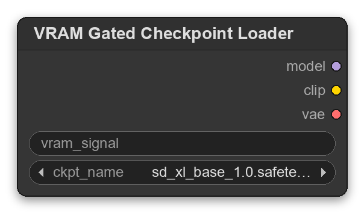

Loads a checkpoint only after receiving a VRAM-cleared signal from VidScribe MiniCPM. Ensures the large VLM model is fully unloaded before loading diffusion models.

**VRAM Gated VAE Loader**

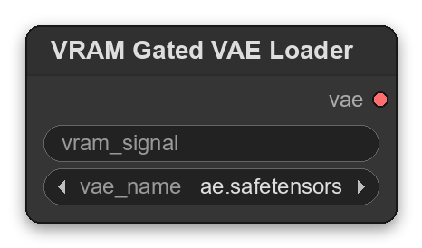

Loads a VAE only after receiving a VRAM-cleared signal. Same sequencing pattern as the gated checkpoint loader.

**VRAM Gated Diffusion Model Loader**

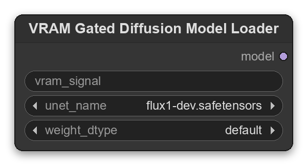

Loads a UNET model only after receiving a VRAM-cleared signal. Use with FLUX or other UNET-based architectures.

**VRAM Gated LoRA Loader (Model Only)**

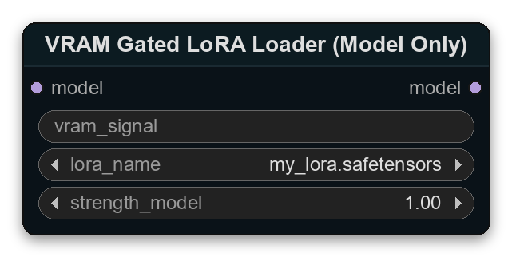

Loads a LoRA (model-only) after receiving a VRAM-cleared signal. Applies LoRA weights to a model with configurable strength.

### Canvas Tools (Frontend Extensions)

These are canvas-level tools that operate on the ComfyUI graph directly -- no Python backend nodes required. They register as commands with keybindings, menu entries, and selection toolbox buttons.

**Grid Paste**
Duplicate any selection of nodes, groups, reroutes, or subgraphs into an automatically-arranged grid. Select your nodes, hit **Ctrl+Shift+;**, type how many copies you want, and they appear in a clean grid at your cursor position. The grid auto-calculates a roughly-square layout (e.g. 9 copies = 3x3) with 50px padding, sizes each cell to the bounding box of your selection, and preserves all internal connections between copied nodes. Widget values, node colors, group rectangles -- everything comes along for the ride.

**Grid Paste Connected**
Same grid layout, but every copy's external inputs are wired back to the original source nodes -- the same behavior as Ctrl+Shift+V but applied in bulk. Hit **Ctrl+Shift+Alt+;** to use this mode. Perfect for scenarios like pasting 6 KSamplers that all need to connect to the same checkpoint loader, or duplicating a ControlNet processing chain where every copy should read from the same source image.

Both modes wrap the entire operation in a single undo transaction, so one Ctrl+Z reverts everything. Maximum 100 copies per operation.

**VHS Swap**
One-hotkey swap of native ComfyUI video nodes to VHS (Video Helper Suite) equivalents. Replaces LoadVideo with VHS_LoadVideo and SaveVideo with VHS_VideoCombine, automatically collapsing intermediate GetVideoComponents and CreateVideo nodes and rewiring all connections. Works on selected nodes or the entire graph. Transfers widget values (filename, fps) and reconnects IMAGE/AUDIO outputs. Requires VHS to be installed. Hotkey: **Shift+V**, also available in the TrentNodes menu.

**Wire VHS Combine**
Companion to VHS Swap that finishes the wiring. Drops in (or reuses) a `VHS_VideoInfo` node off the Load Video's `video_info` output, converts the `VHS_VideoCombine` `frame_rate` widget to an input and connects the source's `loaded_fps` into it, and sets the Combine's format to `video/h264-mp4` with `crf=13`. Selection-aware: with one VHS Load Video + one VHS Video Combine selected, those are used; otherwise it falls back to the single matching pair in the graph. Whole operation is one undo. Requires VHS to be installed. Hotkey: **Shift+Alt+V**, also available in the TrentNodes menu.

**Organize Group as Grid**
Lays out a group's child nodes in a clean left-to-right grid based on connection order. Columns are assigned by topological depth (longest path from a source node), so upstream nodes always sit to the left of their downstream targets — exactly mirroring how the wires read. Within a column, nodes are sorted by the mean y of their downstream targets (barycenter heuristic) to minimize wire crossings, with current y as a fallback for sinks and disconnected nodes. Collapsed nodes right-align inside their column so their output socket stays close to the next column instead of leaving a long horizontal gap. The group resizes to wrap the result, and the entire arrange is wrapped in a single undo transaction. Works on multi-selected groups. Hotkey: **Shift+Alt+A**, also available in the TrentNodes menu.

**Queue Selected Output Nodes**
Queues only the output nodes you have selected, plus everything upstream that feeds them, instead of the whole graph. Handy when a workflow has several save/preview branches and you only want to re-run one. Selecting a group contributes that group's output nodes, and selecting a subgraph node contributes the output nodes inside it. Muted and bypassed nodes are ignored. Honors the batch count. Hotkey: **Shift+Alt+Q**, also available in the TrentNodes menu.

The prompt is pruned on the client, the same approach rgthree uses: everything outside the selected branch is stripped before the request is sent. That matters because core's own `Comfy.QueueSelectedOutputNodes` instead sends the whole prompt with `partial_execution_targets`, so a broken or half-wired branch somewhere else in the graph can still fail validation and block the run. Queueing still goes through `app.queuePrompt`, so `control_after_generate` seeds keep advancing. Logic is covered by `node tests/queue_selected_outputs/run.mjs`.

### 🌐 Trent/API (1 node)

**FAL Kling V2V (O3 Pro)**

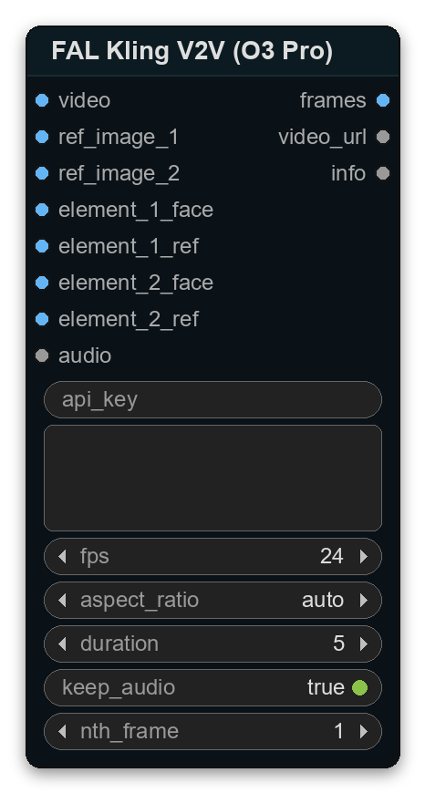

Calls the FAL AI Kling O3 Pro video-to-video reference API to generate new video from a reference video and text prompt. Encodes input IMAGE batch frames to mp4, uploads to FAL CDN, and returns the generated video as frames. Supports optional style reference images (@Image1, @Image2) and character/element injection (@Element1, @Element2) with frontal face + reference image pairs. Optional AUDIO input embeds audio into the uploaded video via ffmpeg muxing -- use with keep_audio=True to preserve it in the generated output. Features auto-appending of @tags for connected inputs so you can write natural prompts, plus a built-in @ autocomplete dropdown in the prompt widget that shows available tags based on which inputs are connected. Images are auto-compressed to JPEG and downscaled if needed to stay within FAL's 10 MB upload limit. Costs $0.336 per second of generated video.

### 🔊 Trent/Audio (2 nodes)

**Audio Length in Seconds**

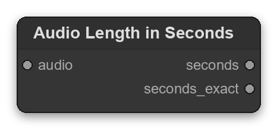

Calculates the duration of an audio input. Returns both the rounded-up integer (always ceiling to the nearest second) and the exact float duration. Handles all ComfyUI audio formats including VideoHelperSuite LazyAudioMap.

**Transcribe Lyrics (Whisper)**

Transcribes any AUDIO input with OpenAI Whisper and returns four outputs: plain `text`, LRC-timed `lrc` lyrics, `segments_json` (start/end/text records), and the `duration` in seconds. Audio over 30 seconds uses transformers' sequential long-form decoding, so timestamps stay absolute and words are not cut at a chunk boundary.

Model choice covers large-v3 (most accurate), large-v3-turbo (much faster), medium, small and base, plus any folder dropped into `ComfyUI/models/whisper/` which appears as `local:<name>`. The model stays cached in VRAM between runs unless you turn off `keep_model_loaded`. `precision` defaults to fp16 on CUDA and fp32 on CPU; the features are always cast to the model dtype, which is what makes this work on transformers 5.x (a plain `from_pretrained` there loads the fp16 checkpoint and then crashes with "Input type (float) and bias type (c10::Half) should be the same"). `hint_prompt` biases Whisper toward names or spellings you supply — note that on clips under 30 seconds a prompt disables timestamps, an upstream transformers limitation. Logic is covered by `tests/test_transcribe_lyrics.py`.

### 🎤 Trent/LipSync (11 nodes)

Complete lip sync pipeline for non-human character animation. Converts audio to mouth shapes and composites them onto tracked positions in video frames.

**Audio To Phonemes**

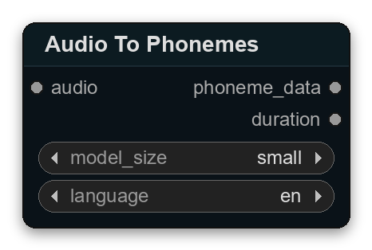

Extracts phonemes from audio using Vosk speech recognition. Returns timestamped phoneme data for mouth shape mapping. Automatically downloads the required Vosk model on first use.

**Phoneme To Mouth Shapes**

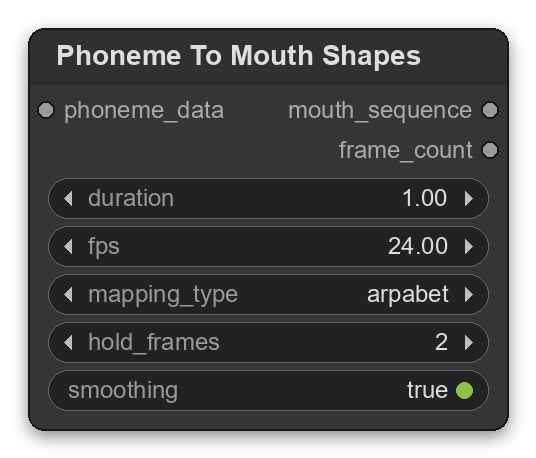

Converts phoneme data to a sequence of mouth shape indices (A-H + X for silence). Maps speech sounds to the 9 standard mouth positions used in animation.

**Mouth Shape Loader**

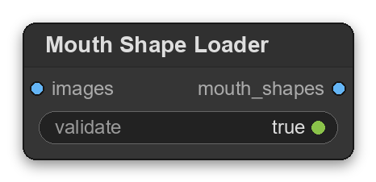

Loads 9 mouth shape images from a folder. Expects files named A.png through H.png plus X.png (silence). Validates all shapes are present and correctly sized.

**Mouth Shape Preview**

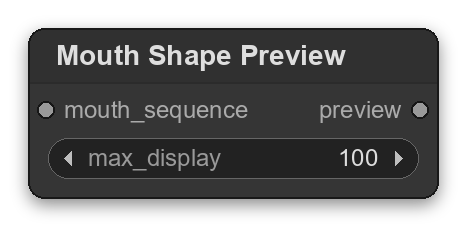

Previews mouth shapes with their corresponding phoneme labels. Useful for verifying mouth shape assets before use.

**Mouth Shape Compositor**

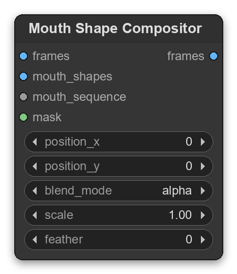

Basic compositor that places mouth shapes on frames at a fixed position. Use for static characters or simple animations.

**Mouth Shape Compositor (Tracked)**

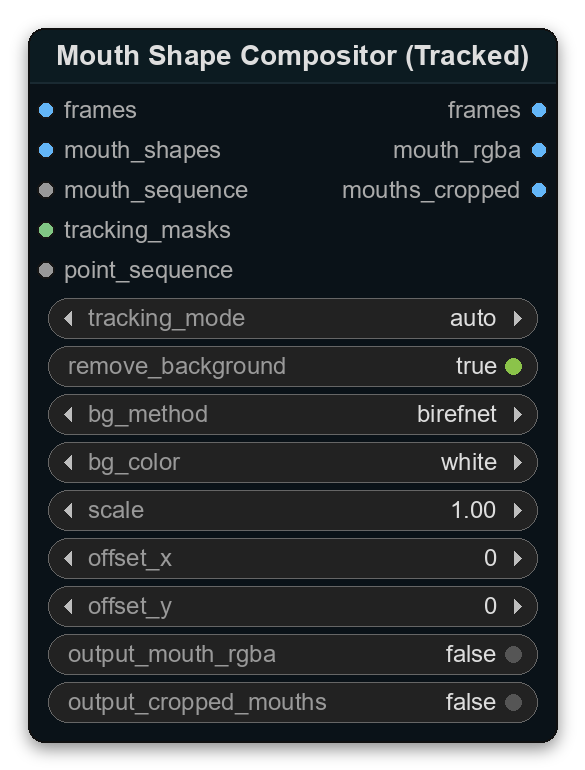

Advanced compositor with tracking support. Places mouth shapes at positions determined by either:
- **Point tracking**: Use tracked (x,y) coordinates from Point Tracker
- **Mask tracking**: Use per-frame masks from SAM3 to find mouth centroids

Features BiRefNet background removal, scaling, offset adjustment, and optional RGBA output for further compositing.

**Creature Lip Sync**

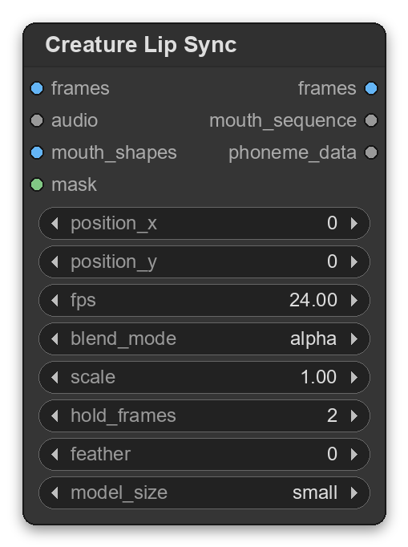

All-in-one lip sync node combining audio analysis, mouth shape selection, and compositing in a single streamlined node. Ideal for quick character animation setups.

**Point Tracker**

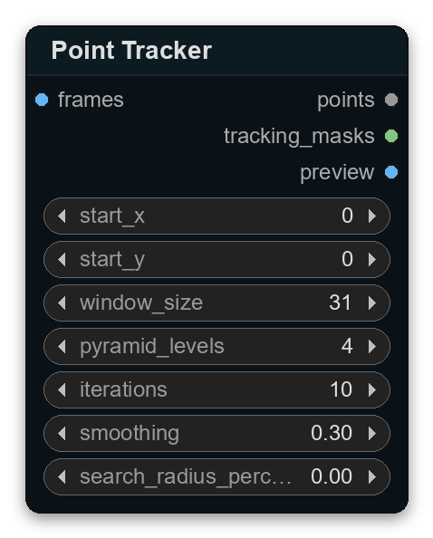

Robust point tracking using pyramidal Lucas-Kanade optical flow. Click a point on frame 1 and track it through the entire video. Features:
- Sub-pixel accuracy with Scharr gradients
- Multi-stage recovery (adaptive template, original template, full-frame search)
- Periodic drift validation against original template
- GPU-accelerated template matching for large search areas
- Configurable window size up to 1025px for full-frame tracking

**Point Preview**

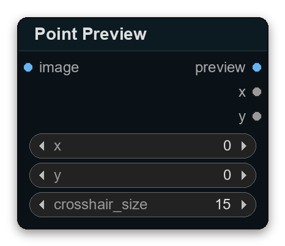

Click-to-pick interface for selecting the initial tracking point. Click anywhere on the image to set coordinates, which pass directly to Point Tracker.

**Points To Masks**

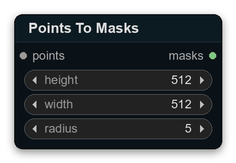

Converts point sequences to gaussian masks for use with mask-based compositing.

**Remove Mouth Background**

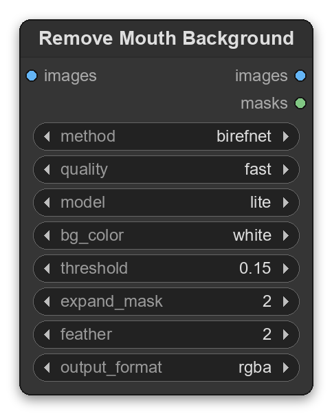

Standalone background removal using BiRefNet or color keying. Returns mouth shapes with alpha channel for custom compositing workflows.

#### LipSync Workflow

1. **Audio To Phonemes** - Extract speech from audio
2. **Phoneme To Mouth Shapes** - Convert to mouth indices
3. **Mouth Shape Loader** - Load your 9 mouth images
4. **Point Preview** - Click to select tracking point
5. **Point Tracker** - Track the point through video
6. **Mouth Shape Compositor (Tracked)** - Composite mouths onto frames

## Requirements

- ComfyUI (latest version recommended)
- Python 3.10+
- opencv-python >= 4.8.0
- numpy >= 1.24.0
- pillow >= 10.0.0
- matplotlib >= 3.7.0
- colorama >= 0.4.6
- vosk >= 0.3.45 (for lip sync speech recognition)
- transformers >= 4.40.0 (for BiRefNet and MiniCPM-V)
- accelerate (for MiniCPM-V model loading)
- fal-client >= 0.4.0 (for FAL AI API nodes)
- requests >= 2.28.0 (for FAL video download)
- timm >= 1.0.0 (for CorridorKey Hiera backbone)
- einops >= 0.8.0 (for CorridorKey tensor operations)

## Features

✅ **69 professional nodes** for video, image, audio, API, VLM, flow control, and lip sync workflows
✅ **Canvas tools** - Grid Paste, VHS Swap, Wire VHS Combine, and Organize Group as Grid (topological group layout)
✅ **Organized categories** - all nodes under `Trent/` namespace
✅ **Auto-discovery** - drop nodes in `nodes/` folder and restart
✅ **Colorful startup banner** with load validation
✅ **Comprehensive error checking** on initialization
✅ **Registry published** - semantic versioning support  

## Development

```bash
# Clone the repository
git clone https://github.com/TrentHunter82/TrentNodes.git
cd TrentNodes

# Install dependencies
pip install -r requirements.txt

# Add new nodes
# Just drop .py files in nodes/ folder - they auto-register!
```

## Contributing

Pull requests welcome! Please:
- Follow existing code style
- Add docstrings to new nodes
- Test thoroughly before submitting
- Update this README with new nodes

## Support

- **Issues**: [GitHub Issues](https://github.com/TrentHunter82/TrentNodes/issues)
- **Registry**: [Comfy Registry](https://registry.comfy.org/publishers/flippingsigmas)
- **ComfyUI Discord**: [Join Server](https://discord.com/invite/comfyorg)

## License

MIT License - see [LICENSE](LICENSE) for details.

## Author

**Trent** - [Trent Films](https://github.com/TrentHunter82)

---

*Made with ❤️ for the ComfyUI community*
